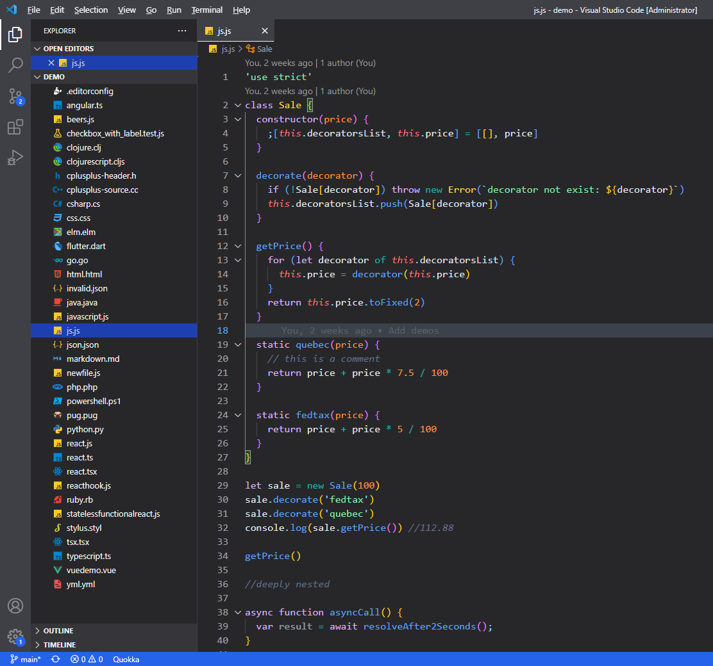
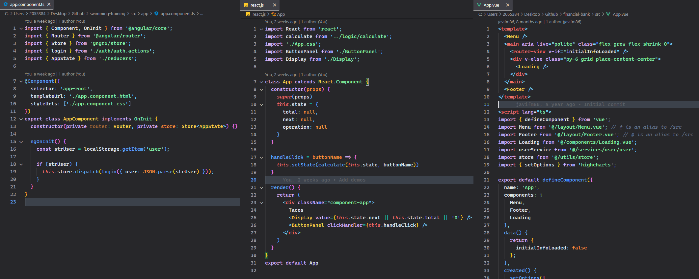

# Oceanic Wind Theme

A Visual Studio Code theme based on color combinations from [Oceanic Next](https://github.com/voronianski/oceanic-next-color-scheme) replaced and customized with [Tailwind CSS color palette](https://tailwindcss.com/docs/customizing-colors).

Almost every color you find is using a Tailwind color, except some rare cases, I couldn't test and may appear default VSCode color.

I did my best for providing good contrast in almost all combinations possible, fulfilling  AA contrast ratio requirements.

## Installation
## Preview



[More screenshots](screenshots/)

## Recommended settings
I like the default font family `Consolas` used in Windows with a font size of 16. Another combination I also like is `Cascadia Code` with ligatures. Font family is a personal decision, use whatever you are used to:
```
"workbench.colorCustomizations": {
  "[Oceanic Wind]": {
    "editor.bracketPairColorization.enabled": true,
    "editor.fontLigatures": true,
    "editor.fontFamily": "Cascadia Code, Consolas, 'Courier New', monospace",
    "editor.lineHeight": 1.5,
    "editor.fontSize": 15,
    "editor.letterSpacing": 0.2,
    "editor.fontWeight": "normal"
}
```

## Customize
You can overwrite colors for a given theme in VSCode settings. I have created different set of colors to provide accent color to VSCode, if you would like to try another color instead of blue for the accent of your IDE, you can use these different combinations:
- [Indigo](customize/indigo.md)
- [Green](customize/green.md)
- [Rose](customize/rose.md)
- [Teal](customize/teal.md)
- [Fuchsia](customize/fuchsia.md)
- [Amber](customize/amber.md)
- [Esmerald](customize/esmerald.md)
- [Sky](customize/sky.md)

If you want to use an accent color, but the selection color is too powerful, you can use a neutral color:
```
"workbench.colorCustomizations": {
  "[Oceanic Wind]": {
    "editor.selectionBackground": "#334155"
  }
}
```
Sidebar, tabs, and editor have the same background, if you would like to try with darker color for sidebar and tabs you can try these combinations:

### Darker sidebar and tabs
```
"workbench.colorCustomizations": {
  "[Oceanic Wind]": {
    "editorGroupHeader.tabsBackground": "#18181b",
    "tab.inactiveBackground": "#18181b",
    "tab.unfocusedInactiveBackground": "#18181b",
    "sideBar.background": "#18181b",
    "activityBar.background": "#27272a"
  }
}
```

### Darker editor
```
"workbench.colorCustomizations": {
  "[Oceanic Wind]": {
    "editor.background": "#18181b", 
    "editorGutter.background": "#18181b"
  }
}
```

## Misc
I have tested this theme focused on my day-to-day workflow, with HTML, CSS, Javascript, Typescript and developing with frameworks such as Angular, Vue and React. Furthermore, I have tried with files you can find in demo folder (thanks to Wes Bos and Sarah Drasner).

If you find something amiss, you have any suggestion or improvement, please feel free to open and issue. I'm sure there are things I missed.

I am not a designer, so any help or feedback would be really appreciated.
## Thanks to
- [Sarah Drasner](https://twitter.com/sarah_edo), I picked up some ideas from her [blog post about creating themes](https://css-tricks.com/creating-a-vs-code-theme/). I also copied files from her demo folder on [Night Owl theme](https://github.com/sdras/night-owl-vscode-theme).
- [Wes Bos](https://twitter.com/wesbos), I grabbed some demo examples from his [Cobalt2 theme](https://github.com/wesbos/cobalt2-vscode).
- [Tailwind CSS team](https://twitter.com/tailwindcss), I used their beautiful color palette to choose every color in this theme.
